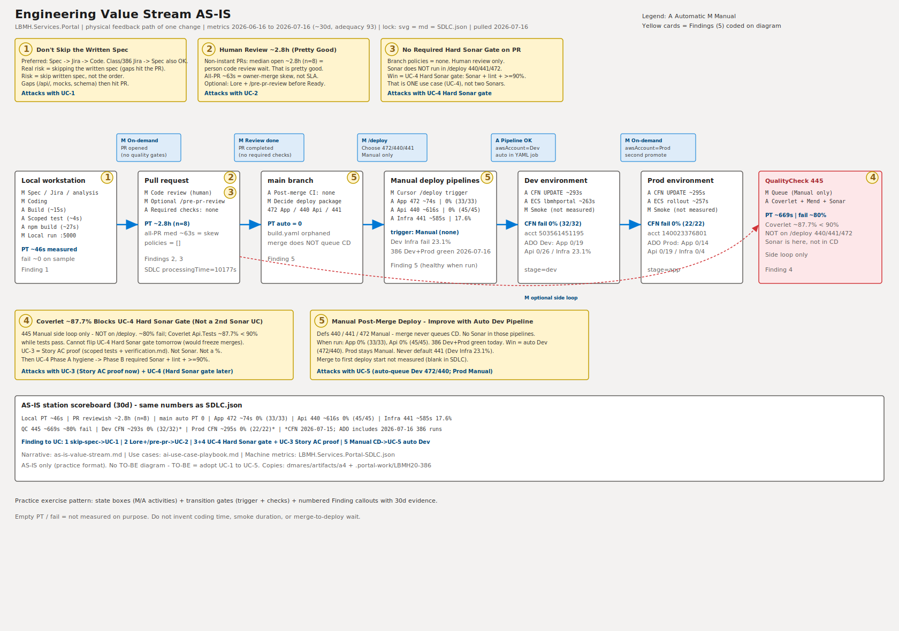
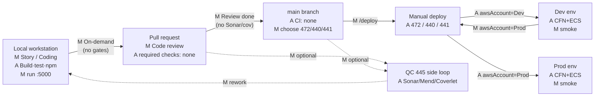

# Engineering Value Stream AS-IS

**Feedback diagram** — physical path of one code change across environments to production  
(not a logical “develop → test → release” checklist).

| | |
|---|---|
| **Metrics (source of truth)** | [`LBMH.Services.Portal-SDLC.json`](LBMH.Services.Portal-SDLC.json) |
| **Window** | **2026-06-16 → 2026-07-16 (~30d)** — adequacy **93** (best dataset; includes LBMH20-386 Dev+Prod deploy day) |
| **Pulled** | **2026-07-16** — live ADO re-pull of defs **440 / 441 / 445 / 472** + completed PRs → `main` |
| **Visual (practice format)** | [`Portal-AS-IS-Value-Stream.svg`](Portal-AS-IS-Value-Stream.svg) |
| **Use cases from Findings** | [`ai-use-case-playbook.md`](ai-use-case-playbook.md) |
| **Copies** | `dmares/artifacts/a4-use-case-playbook/` · `.portal-work/LBMH20-386/` |

**Legend:** **A** = Automatic · **M** = Manual  

**Lock:** SVG labels = this file = SDLC JSON (`processingTime` / fail rates). Empty = not measured.

---

## Live evidence — LBMH20-386 Dev + Prod (2026-07-16)

Same-day Manual `/deploy` after [PR 9220](https://dev.azure.com/ECI-LBMH/LBMH-Spruce/_git/LBMH.Services.Portal/pullrequest/9220) merged (`5192cf4a`). Package = **App 472 + Api 440** (no Infra 441). All four runs **succeeded**. Human smoke confirmed on Dev and Prod.

| Pipeline | Env | Build | Duration | Result | Link |
|----------|-----|-------|----------|--------|------|
| App **472** | Dev | **29594** | **97s** | ✅ | [run](https://dev.azure.com/ecisolutions/LBMH-Spruce/_build/results?buildId=29594) |
| Api **440** | Dev | **29595** | **674s** | ✅ | [run](https://dev.azure.com/ecisolutions/LBMH-Spruce/_build/results?buildId=29595) |
| App **472** | Prod | **29598** | **272s** | ✅ | [run](https://dev.azure.com/ecisolutions/LBMH-Spruce/_build/results?buildId=29598) |
| Api **440** | Prod | **29599** | **835s** | ✅ | [run](https://dev.azure.com/ecisolutions/LBMH-Spruce/_build/results?buildId=29599) |

**What this proves on the map:** when someone runs `/deploy`, App/Api are healthy (Finding **5** — pain is **memory / lead time**, not flaky CD). Still **Manual** — that is why **UC-5** is auto-queue **Dev** only.

---

## Feedback diagram (states + transitions)

---

## States (M/A activities — match SDLC)

### Local workstation

| Activity | Type | PT | Fail | Notes |
|----------|------|----|------|-------|
| Story analysis | M | — | — | Optional Portal Jira AI path |
| Coding | M | — | — | API + React + optional CDK |
| Build | A | ~15s | 0 | Sample 2026-07-15 |
| Scoped unit test | A | ~4s | 0* | *Full suite may fail pre-existing |
| npm build | A | ~27s | 0 | → Api/wwwroot |
| Local run :5000 | M | — | — | Okta + SQL |

**State PT (measured):** ~46s · **Transition out:** **M** On-demand → PR (no quality gates)

### Pull request

| Activity | Type | PT | Fail | Notes |
|----------|------|----|------|-------|
| Code review (human) | M | **~2.8h** | — | 30d excl-&lt;5m, **n=8** |
| Optional `/pre-pr-review` | M | — | — | Not ADO-required |
| Required status checks | A | **0** | — | policies = `[]` |

**Transition out:** **M** Code review completed → main (no Sonar / coverage required)

### main branch

| Activity | Type | PT | Notes |
|----------|------|----|-------|
| Post-merge CI | A | **0** live | `build.yaml` orphaned |
| Decide deploy package | M | — | 472 / 440 / 441 |

**Transition out:** **M** `/deploy` → Manual deploy pipelines

### Manual deploy pipelines

| Activity | Type | PT | Fail (30d) |
|----------|------|----|------------|
| App 472 (`Deploy.LBMH.Services.Portal.App`) | A | ~74s | **0%** (**33/33**) |
| Api 440 (`Deploy.LBMH.Services.Portal.Api`) | A | ~616s | **0%** (**45/45**) |
| Infra 441 | A | ~585s | **17.6%** (3/17); Dev **23.1%** |
| Cursor deploy skill trigger | M | — | `trigger: none` in YAML |

**By account (30d):** App Dev **0/19** · App Prod **0/14** · Api Dev **0/26** (med ~608s) · Api Prod **0/19** (med ~628s)

**Transition out:** **A** pipeline success → Dev or Prod per `awsAccount`

### Dev environment

| Activity | Type | PT | Fail |
|----------|------|----|------|
| CFN UPDATE | A | ~293s | **0%** (32/32)* |
| ECS `lbmhportal` | A | ~263s | — |
| Smoke | M | — | not measured (386 smoke ✅ 2026-07-16) |

\*CFN corroboration from AWS pull **2026-07-15**. ADO Dev App/Api in this window include today’s 386 runs.

**Transition out:** **M** On-demand → re-run with Production account

### Prod environment

| Activity | Type | PT | Fail |
|----------|------|----|------|
| CFN UPDATE | A | ~295s | **0%** (22/22)* |
| ECS rollout | A | ~257s | — |
| Smoke | M | — | not measured (386 smoke ✅ 2026-07-16) |

\*CFN corroboration from AWS pull **2026-07-15**.

### QualityCheck 445 (side loop — not CD)

| Activity | Type | PT | Fail | Precision as CD signal |
|----------|------|----|------|------------------------|
| Sonar / Mend / Coverlet | A | ~669s | **~80%** | **low** |

Coverlet Api.Tests line ~87.7% &lt; 90% while tests pass (build 29300).

---

## Findings (5) — practice format

Numbered yellow callouts on the SVG. Same five drive the playbook UCs.

### 1 — Don’t skip the written spec

**Preferred for tech-heavy Portal work:** Spec → Jira → Code.  
**Class / 386 trail:** Jira → Spec → Code — also fine when the ticket already exists.  
**Finding:** not “wrong order” — **skipping a written spec** so gaps (`/api/`, mocks, schema) hit the PR. Lots of teams skip this step; that’s the risk.

**Coded on:** Local workstation · **UC-1**

### 2 — Human review ~3 hours (pretty good; optional Lore + `/pre-pr-review`)

**What ~2.8h is:** Among non-instant PRs (not owner-merged in &lt;5 min), median open time ~**2.8h (n=8)** — mostly waiting on / doing **person** code review.  
All-PR **~63s** is owner-merge skew, not the team SLA.  
**Stance:** ~3 hours is **pretty good**. Opportunity (not emergency) = **Lore** + **`/pre-pr-review`** to catch nitpicks before humans review.

**Coded on:** Pull request · **UC-2**

### 3 — No required Sonar / lint / coverage on the PR

Branch policies on `main` = **none**. Human review is the only merge gate.  
**Sonar does not run in `/deploy` (440 / 441 / 472).**  
**One** program: **UC-4 Hard Sonar gate (Sonar + lint + ≥90%)** on PRs — **UC-4** only.

**Coded on:** Pull request · **UC-4** Hard Sonar gate

### 4 — Coverlet ~87.7% blocks the Hard Sonar gate for now

**445** is an optional Manual side loop (Sonar / Mend / Coverlet). **Not on `/deploy`.**  
30d: ~**80%** fail; dominant = Coverlet Api.Tests **~87.7% &lt; 90%** while tests pass.  
**So:** we can’t turn on UC-4 tomorrow without freezing merges.  
**Meanwhile:** every feature story still writes a **Story AC proof** — scoped tests + `verification.md` (**UC-3**, not Sonar, not a %).  
**Then:** hygiene → flip **UC-4 Hard Sonar gate** (Phase A → B). Finding 4 enables Finding 3 — **not** a second Sonar UC.

**Coded on:** QC 445 side loop · **UC-3** Story AC proof (now) + **UC-4** Hard Sonar gate (later)

### 5 — Post-merge deploy is Manual → auto Dev

Defs **440 / 441 / 472** are Manual — merge never queues them. When run: App **0% (33/33)**, Api **0% (45/45)**, Prod CFN **0%**.  
**2026-07-16 exemplar:** four green Dev+Prod runs for LBMH20-386 (table above).  
**Finding:** forgotten-deploy / lead-time wait. **Fix:** auto-queue **Dev** 472/440 on **merge** (**UC-5**). Prod stays Manual; never default 441 (Dev Infra 23.1%).

**Coded on:** main + Manual deploy · **UC-5**

---

## Finding → Use case map

| Finding | Title (short) | Use case |
|---------|---------------|----------|
| **1** | Don’t skip the written spec | **UC-1** |
| **2** | ~3h review OK; Lore + `/pre-pr-review` | **UC-2** |
| **3** | No required PR gates; Sonar ≠ `/deploy` | **UC-4** Hard Sonar gate (Sonar + lint + ≥90%) |
| **4** | Coverlet blocks Hard Sonar gate for now | **UC-3** Story AC proof · **UC-4** Phase A→B |
| **5** | Manual CD → auto Dev on merge | **UC-5** |

AS-IS only — no TO-BE diagram. TO-BE = adopt UC-1…UC-5 in the playbook.

---

## Station scoreboard (30d lock)

| Station | PT | Fail | n |
|---------|----|------|---|
| Local (sample) | ~46s | ~0 | sample |
| PR reviewish | **~2.8h** | — | **8** |
| main auto CI | **0** | — | — |
| App 472 | **~74s** | **0%** | **33** |
| Api 440 | **~616s** | **0%** | **45** |
| Infra 441 | ~585s | **17.6%** | 17 |
| QC 445 | ~669s | **~80%** | 15 |
| Dev CFN* | ~293s | 0% | 32 |
| Prod CFN* | ~295s | 0% | 22 |

\*AWS CFN corroboration pulled 2026-07-15 · ADO deploy counts include 2026-07-16.
